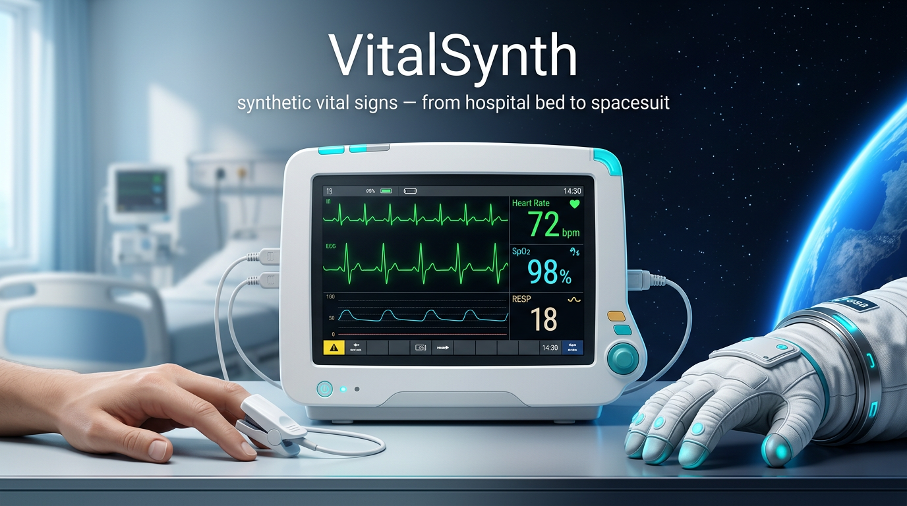
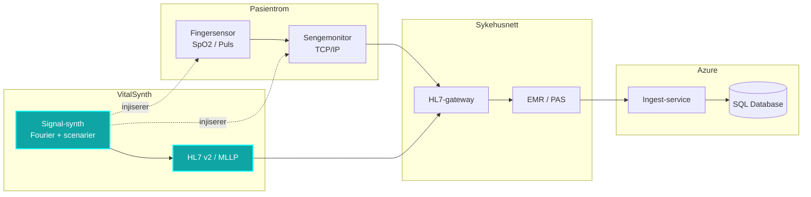
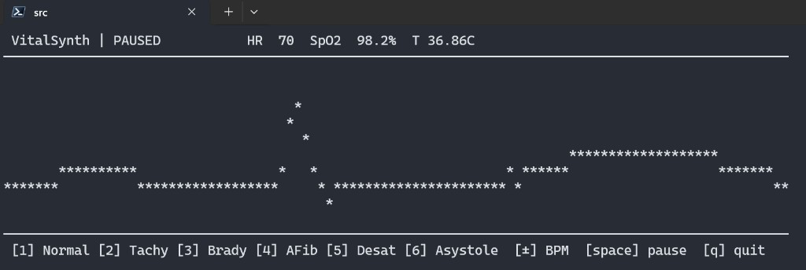

# VitalSynth

**En synthesizer for livstegn.**
Programvare som genererer realistiske, syntetiske vitale signaler i sanntid — puls, respirasjon, SpO₂, temperatur — for testing, integrasjon og feilsøking av medisinsk utstyr.

---

## Hvorfor

> *«Et EKG er egentlig bare et elektrisk signal.  
> Så hvorfor ikke generere det som en synth?»*

- **Forutsigbart** — samme scenario, hver gang.
- **Kontrollerbart** — styr BPM, arytmier, desaturasjon, feber på knotter.
- **Sporbart** — plugg inn hvor som helst i kjeden og følg signalet til databasen.

---

## Bruksområder

| Område | Hva VitalSynth gir |
|---|---|
| Medtech-utvikling | Syntetisk pasient for enhet-, integrasjons- og regresjonstester |
| Sykehus-IT | Verifisering av HL7-flyt fra sengepost til journalsystem |
| Feltingeniør | Signalinjektor for å feilsøke datastrøm ende-til-ende |
| Romfart / ESA-hanske | Mockdata til sensorhansker før maskinvaren er ferdig |
| Demo & opplæring | Reproduserbare kliniske scenarioer på kommando |

---

## Dataflyt



Ingeniøren kobler **VitalSynth** inn på et hvilket som helst punkt — sensor, sengemonitor, gateway, sky — og får en **lukket feedback-loop** gjennom hele stacken.

---

## Konsept

Et hjerteslag er en **bølgeform**.  
Livstegn-generering er **procedural audio** i et annet frekvensbånd.

VitalSynth bygger EKG-kompleks (P-QRS-T) som en **Fourier-rekke** med kontrollert jitter, pustemodulasjon og scenario-sekvenser — direkte inspirert av **FastTracker**-estetikken fra Amiga-demoscenen.

| Synth | VitalSynth |
|---|---|
| Oscillator | Hjerte-oscillator (QRS-bølge) |
| LFO | Respirasjonsmodulasjon |
| Envelope | Temperaturdrift |
| Pattern/tracker | Kliniske scenariosekvenser |
| MIDI ut | HL7 v2 / FHIR ut |

---

## Prototype

Se [`src/VitalSynth.cs`](src/VitalSynth.cs) — en selvstendig C#-fil som genererer EKG, puls og SpO₂ i sanntid og sender ut HL7-lignende meldinger.



```bash
dotnet run --project src
```

---

## Status

> Prototype / pitch. Ikke medisinsk utstyr. Ikke for klinisk bruk.
